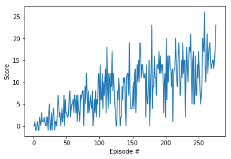

### Algorithm
I used a plain vanilla DQN similar to the implementation in the previous exercises. 

Score plot of an agent that solved the environment in 177 episodes:

### Hyperparameters
Neural network: I tested several configurations, starting from only 1 hidden layer up to 3 hidden layers, with number of hidden units ranging from 32 to 128. Two hidden layers with 32 units seem to work best.
Learning rate: Choosing an aggressive learning rate (0.96) was the most relevant parameter for reducing the number of episodes needed to solve the game.

### Improvements
Further improvements could be:
 - Try other DQN approaches (Double DQN, Dueling Networks, Rainbow)
 - Try learning from Pixels (DQN or some Policy Gradient Method)
 - Do a more systematic hyperparameter tuning (loss fct and optimizer included)
